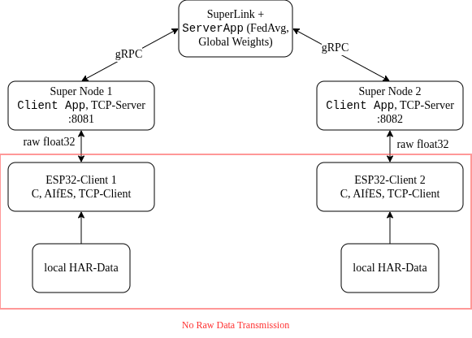

# IMPORTANT NOTE
This project was implemented by J. Pretzel, A. Newe, S. Goldstein, J. Lammers, and M. Berlin



# ods-prog-prak
This project aims to be a Proof of Concept implementation Federated Learning performed on a Flower.ai client with an ESP32 using ~300kB RAM.
The main focus is to prove that training an AI on an ESP32 is realistic for as much RAM as physically possible.
We proved that this is possible with the example of simulating physical motion with an Human Activity Recognition (HAR) dataset.
In fact we could even store the 180 entries dataset statically (100 floats each) on the ESP. This is an overhead that an real sensor would circumvent and would allow bigger models and more complex datasets as this proof of concept.

## Structure
The resulting distributed system is comprised of:
- the ESP32 client running on the chip. Its task is to establish a TCP connection with the proxy, receive the weights and pass them into the AIFES library which trains on a random subset of the available dataset. The precise configuration of the Machine Learning aspect, like the shape of the neural network, the learning rate, initial weights, epoch number etc., are situated in `train.h`.
- a single "SuperLink" process that just orchestrates the other Flower components and talks to the server (`server_app.py`). The server performs the Federating Averaging (FedAvg) method
- a "SuperNode" per client that connects the ESP32 client with the SuperLink and acts both as a bridge allowing for unified communication, as well as a proxy for the main server. For the sake of compactness and performance, the ESP32 only supports a bare TCP communication sending bare floats with their number known in advance, while the Flower server expects the HTTP/2 protocol leveraging the gRPC network. With the SuperNode, Flower.ai provides a translation layer themselves. Our task was to write a `client_app.py` implementation that overrides the communication of the SuperNode and the encoding of its messages. It is also ran once per connected client. To see this in practice see `test/tmux.sh` which trains with two devices.

## Installation

### ESP-IDF
1. Get the esp-idf repo: `git clone https://github.com/espressif/esp-idf.git --recursive`
2. Run `install.sh` (or `install.fish` or `install.bat`, depending on your shell)
3. Source: `. ./export.sh` (or the equivalent)

### ESP32 code
1. Ensure you sourced the esp-idf. Confirm by running `idf.py --version`
2. Navigate into the ESP directory: `cd esp/`
3. Plug in the ESP per USB.
4. Fill out `esp/main/wifi_credentials.h`. An example is at `esp/main/wifi_credentials.example.h`.
5. build, run and watch: `idf.py build flash monitor`. Ensure that your user is added to the necessary groups. See more [here](#cant-open-serial-ports-permission-denied). On Linux, to fix this, add yourself to the `dialout` or the `uucp` group. (To see the magic happen you have to start flower as well, see [here](#Flower)).
Use `idf.py -p DEVICE_PATH build flash monitor` to specify which device to pick if you have multiple. Otherwise it picks randomly.
Alternatively, you can use the `Makefile` that just does this:

```sh
make               -> idf.py build flash monitor
make build         -> idf.py build
make flash         -> idf.py flash
make flash monitor -> idf.py flash monitor
```

For running multiple esps you have to give everyone an extra port to connect to a seperate proxy. Default is 8081 and scaling up from there. Note that this has to be done at compile time in `esp/main/wifi_credentials.h`

#### Building on Linux
idf.py also supports building to Linux. For this, prior to running `idf.py build`, please run `idf.py --preview set-target linux` once.
Building should generate a `build/flower-client.elf` which should be an executable of the correct architecture. Then, proceed as usual with `idf.py falsh monitor`.
To switch back to building for the ESP32, set the target again: `idf.py --preview set-target esp32`.

Note however, that even though Linux uses a separate network stack, it is currently broken and will crash communications with the proxy server.
When this is resolved, everything should work the same as on the ESP32.
Therefore, Linux can currently only be used to run the training demo, described in more detail [here](##running-local-demo).

### Flower
To run the Flower server and proxy:
1. Create a Python venv in the projects root: `python -m venv .venv`
2. Source the venv: `. .venv/bin/activate` or similar for your shell
3. Install Flower: `pip install flwr`
4. Edit `~/.flwr/config.toml` and append the following:
```toml
[superlink.embedded]
address = "127.0.0.1:9093"
insecure = true
```

## Running
1. Navigate into the flower directory: `cd flower/`
2. Execute the following commands in seperate windows (they all have to run the whole time)
```
flower-superlink --insecure
flower-supernode --insecure --superlink 127.0.0.1:9092 --clientappio-api-address 0.0.0.0:9094 --node-config 'port=8081'
flower-supernode --insecure --superlink 127.0.0.1:9092 --clientappio-api-address 0.0.0.0:9095 --node-config 'port=8082'
flwr run . local --stream
```
Note that the flower-supernode commands have to be as many as the training ESP clients. Scale ports up accordingly. Don't forget to also put the port (here 8081 and 8082) in the esps config. Every esp should map to one supernode via the IP and port.
3. Also run the ESP software now. Note that the ESP needs to know the IP address of the device running these Flower services at compile time through `wifi_credentials.h`!

Note: This will only work when compiling for ESP32. Linux wifi is currently broken and crashes during weight transfer.

### Shortcut using Tmux
If you have the **tmux** terminal multiplexer installed on your system and after you performed the installation, you can launch the entire simulation by running the script found at `test/tmux.sh`.
Note however that it requires some setup:
1. `esp-idf` has to be installed at `./esp-idf/`, where `.` is the project root
2. the venv has to be installed at `./.venv/`

### Local Demo
The ESP code includes a demo for local AI training without federated learning.
To switch from federated learning to this demo edit `esp/main/main.c` to look like this:

```c
void app_main(void) {
	init_wifi();

	// USE ONLY ONE OF THESE!

	// This is for federated learning
	// xTaskCreate(network_task, "network_comm", 65536, NULL, 5, NULL);
	// This is the local demo training the AI fully locally 
	xTaskCreate(training_task, "training", 65536, NULL, 1, NULL);
}
```
By default this will do 1000 epochs. To change this edit the `epochs` value in `esp/main/train.h`
This should work on Linux and ESP32.

## Configuring
You can change the model, model parameters, learn rate and more.
To keep this project minimal, there is no config file, all configurations are done at compile time. Therefore you are not limited to single values, you can do whatever you want. But these are the recommended fields to easily change:

### train.h
- `enum HarClass { WALKING, UPSTAIRS, DOWNSTAIRS, SITTING, STANDING, LAYING, OUTPUT_NEURONS }` fully changable to new moves or other models
- `LAYER_0, LAYER_1, ...` all of these can be changed or even more added. If more are added the math in TOTAL_PARAMETERS has to changed. Also all layers have to be in model_structure. If these are changed you also want to change the values in `flower/quickstart_numpy/server_app.py` They are orthogonal to these and have to line up!
- `model_structure` as said above this with `LAYER_X` describes the model
- `model_activations`
- `learn_rate`
- `epochs` this is only used for the demo. Normally epochs are hardcoded to 1
- `batch_size`

In train.c you could also change more advanced options like the optimizer. See the `static const AIFES_E_training_parameter_fnn_f32 train_params` in `aifes_train_epoch`.

### training data
- You can change the HAR dataset to your own. The HAR dataset will give you an idea. It lies at `esp/main/har_dataset.h`
- You can change any of these values and dataset but `HAR_NUM_FEATURES` has to be equal to `LAYER_0` and `HAR_NUM_CLASSES` has to be equal to `OUTPUT_NEURONS`

## Troubleshooting

### ESP-IDF errors when building
IDF probably did not properly download every submodule correctly.
This is sadly only detected when running `idf.py build`.
Look at the error code, see what's missing, confirm that the directory is not existent and reset this submodule.
As an example, the dependency `mbedtls`:

```sh
cd esp-idf/
git submodule deinit -f components/mbedtls/mbedtls
rm -rf components/mbedtls/mbedtls
git submodule update --init components/mbedtls/mbedtls
```

Though if one submodule is broken, probably more are and it would be easier and safer to reset `esp-idf` fully and redownload all git submodules.

### Can't open serial ports, permission denied
On Linux, to fix this, add yourself to the `dialout` or the `uucp` groups. 
Use the one your system uses:
`sudo usermod -a -G uucp bob`
Then log out, log back in and try again.
